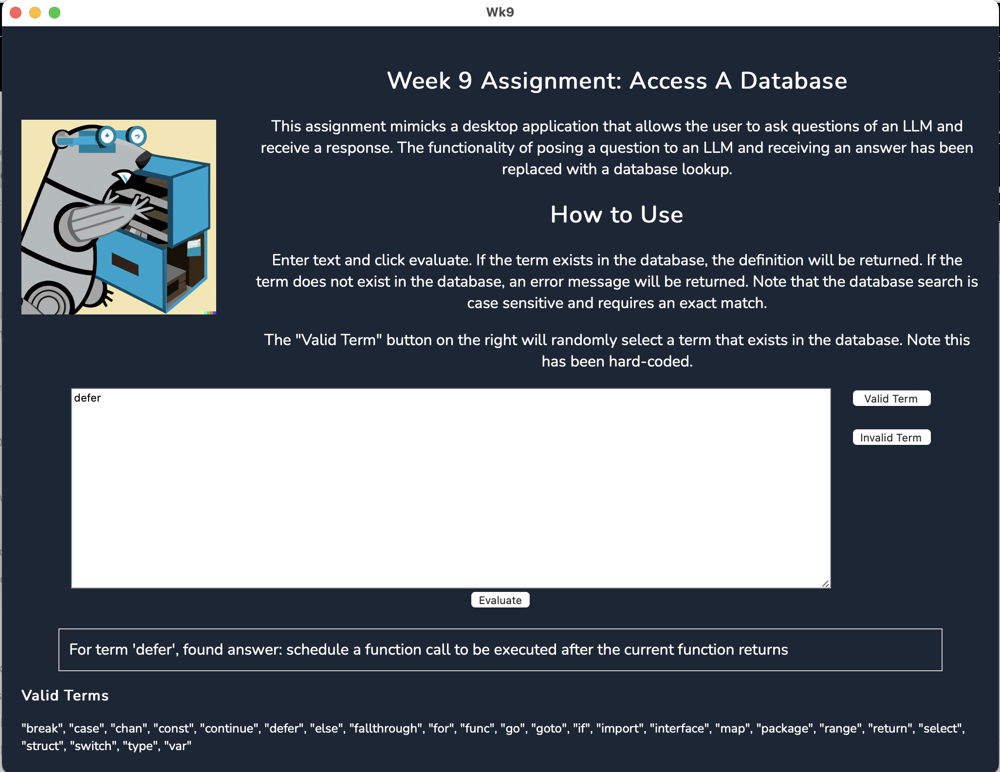

# Overview of Project

This is an assignment for Week 9 in the Northwestern Masters in Data Science [MSDS-431 Data Engineering with Go](https://msdsgo.netlify.app/data-engineering-with-go/) course.

The purpose of this assignment was to build a desktop application using wails and svelte that would mock up the front end of a desktop chatbot application where a user could ask a question to a Large Language Model and receive the response.  Rather than going through the complexity of building an LLM, the mocked backend is a simple database query built off of a database given to us: enter a keyword in the "question" box and the program will query the database and return an answer.

# Engaging With Product

## Final Product Details

The final product is the Wk9.app or Wk9.exe located at ./build/bin/.  This is an executable file that uses the wails framework (with svelte templating) to serve up an electron-style webview on your desktop.  This application is bundled with the target database of questions and responses, and includes the key functionality necessary to engage with the tool.

### Screenshot of the Tool:



It's pretty straightforward:
* Enter text in the big window that says "defer" and click Execute.  If the term exists in the database then the response will be provided, otherwise you'll be notified the term doesn't exist
* The buttons on the right can be clicked to immediately serve up a random word from the valid list or a random word from a list of silly terms, respectively.  FWIW, this is hardcoded

Btw - that gopher is a Stable Diffusion imagining of the golang gopher.  Classy, right?  Not terrifying at all.

# Describe the Plan for What's Next.  Specific Answers to Specific Questions

The assignment states: "As part of the README.md description of the software project, describe the plan for further development of the AI-assisted tutoring system." And then specific questions follow.

**What are the expected software components?**

There's a fundamental delivery question, which is whether we design and deliver this as a website or as a standalone application.  The use cases for either can be created and justified, and will have implications on all of the other considerations for this project.  To stick with the thesis of the assignment, I'll presume that the owners of the firm employing we data scientists are biased to delivering a desktop application.  Further, I'll presume that we're doing it in a way that means we don't have reliable internet access.

With that said, we will need the following infrastructure:
1. Database of questions and answers
2. An interpretation layer, which takes questions from the user and delivers results from the database
3. A front end processing layer that users can interact with.

Item #1 is built to a minimally viable spec, although sqlite isn't designed to handle massive amounts of data and/or concurrent users.  In my hypothetical above where the app is built and deployed with the sqlite server embedded in the app, the big determination for whether sqlite would work is if the database got too big.

Item #2 is far insufficient for what we would need.  If we lean on, for example, some of the approaches we took in [MSDS-453 Natural Language Processing](https://github.com/weswest/MSDS453), then two immediate options come to mind:
2a. Run cosine similarity to quantitatively match the question asked with questions in the database.  The top-scoring question(s) is/are then used to return a sql lookup similar to how this project exists right now.  We essentially loosen the requirement for a direct match with a fuzzy match, using sophisticated and generally accepted techniques
2b. Run a predictive model trained on question/answer pairs.  Same deal, produce a "match" score, but do it using an LLM.

2a wouldn't require a ton of additional work on top of what we are already doing.  We'd need to build some logic to maintain a list of questions and their appropriate vectors, and then build some logic to run the cosine similarity scores.  The existing infrastructure to look up a query from the database and return it would be left intact.  I doubt this would materially increase the size of the application but we would need to optimize performance.

2b would require embedding a language model in the app, as well, which would increase the application size by dozens or hundreds of MB.  We would also need to figure out how to run a tensorflow model in Go, which seems straightforward to do.  Same deal: once a score is produced then we have the infrastructure to deliver an answer.

Item #3, the front-end display, is also more or less complete.  I won't win any awards for design aesthetic but it works and it's pretty straightforward to change the look and feel.


**Will the SQLite foundation be sufficient, or will a hosted database (perhaps a database with vector objects) be needed for the final project?**

In my envisioning of this app being distributed to desktops in an internet-free environment, I think sqlite will be sufficient for a long time.  You lose some functionality but it's also dead simple to use.

Note that this would necessitate redeployment of the app if the database changed materially.  Oh well.  Schools are always operating with older equipment.


**Will Go suffice for all components, or will other languages such as Python be needed for language processing?  Recognize that many contemporary systems employ a microservices architecture with self-contained components developed in diverse languages.**

As noted above, question/answer models are available off-the-shelf from HuggingFace.  These can probably be imported directly into go.

So yeah, the app can probably be run in go/javascript.  Leveraging other tools will be helpful but I don't think it's necessary to get to a final delivered package.

# What Was Hard About This

## Hardest Part: Embed a Database in Wails App

The hardest part was figuring out how to embed the database of questions in the go code so that it would be bundled with the app.  For anyone looking for the answer, the solution was to put this code in the file **'./backend/dbQuery.go'**:


```golang
//go:embed dist/QandA.db
var database embed.FS
```

This instruction is run at runtime and embeds the database into the go executable.

Then, when I wanted to query the database, the querying function included the following (also in **'./backend/dbQuery.go'**'):

```golang
	// Read the embedded database into memory
	dbData, err := fs.ReadFile(database, filepath.Join(dbDirName, dbFileName))
	if err != nil {
		return "", false, fmt.Errorf("No database found. Did you build it? Check the following:\n1. Go to ./setup and run \"runThisFirstDatabaseCreate\". You may need to add the flag -forceRebuild=true\n2. Verify that there is a valid file at ./backend/dist/QandA.db\n3. Run 'wails build' again to rebuild.")
	}

	// Use the in-memory database driver of SQLite
	db, err := sql.Open("sqlite", "file::memory:?cache=shared")
	if err != nil {
		return "", false, fmt.Errorf("sql.Open failed: %s", err)
	}
	defer db.Close()

	// Create a temporary file in the system's temp directory
	tempFile, err := os.CreateTemp(os.TempDir(), "tempdb-*.sqlite")
	if err != nil {
		return "", false, fmt.Errorf("failed to create temp database file: %s", err)
	}
	defer os.Remove(tempFile.Name())

	// Write the embedded database data to the temporary file
	_, err = tempFile.Write(dbData)
	if err != nil {
		return "", false, fmt.Errorf("failed to write to temp database file: %s", err)
	}
	tempFile.Close()

	// Attach the temporary file to the in-memory database
	_, err = db.Exec("ATTACH DATABASE ? AS memdb", tempFile.Name())
	if err != nil {
		return "", false, err
	}
```

I would be surprised if this is the best way to tackle this, especially because it means the database is read and then rewritten every time it's queried.  Since this is a minimally viable product and the database is all of 8 kb, I didn't worry about it, but this would need to get resolved if this project were to grow.

Note: one thing I was pretty proud of was that when I was testing how to bundle the database with the app I created a temporary database that was 5000x the size of the database we were supposed to use (~8-9 mb) and tried attaching that.  This allowed me to very quickly see if the app created from "wails build" included the database: it was 13MB without the database and 22 MB with.  Saved me a bunch of time by not needing to open the app and run it to see if the database worked.

## Everything Else

Everything else was actually pretty straightforward.

# FYI - assignment details motivating this work

### Management Problem

Managers of a technology startup focused on online education are excited about the possibilities of AI-assisted tutoring. News reports suggest that major institutions of higher learning are beginning to use chatbot tutors: 

CS50's AI-based chatbot on NewsNation with Marni Hughes - July 7, 2023.
Data scientists at the firm believe they can build a chatbot tutor using embeddings from open-source language models and a database of questions and answers from past classroom discussions. They propose to develop a prototype for AI-assisted training in the Go programming language. Ultimately, after the prototype has been completed, they believe they may be able to build on the OpenAI API to ChatGPT or Bard from Google, perhaps using starter code from an open-source GitHub repository: https://rollbar.com/blog/how-to-use-chatgpt-api-with-golang/.

Not surprisingly, given the company's past success with Go, the data scientists plan to use Go to build the prototype AI-assisted chatbot, a desktop application that answers student questions about the Go programming language.  One manager at the startup puts it this way: 

*We're not talking about a copilot or AI-driven peer programmer. We're talking about a tutor who can answer questions about Go, much as we might expect an experienced Go software engineer to answer questions about Go. Our guess is that we will need to marry a specialized Go knowledge base with a language model. If we can demonstrate success with the Go tutor prototype, then we can move on to building tutors for other knowledge domains.*

The plan is to develop a product prototype over the next few months. As a first step, the firm wants to implement a straightforward database for storing Go questions and answers.

A preliminary knowledge base has been developed for use with the application. This has been implemented within unstructured text fields in an SQLite database.  Questions in the initial database are single words, as we might expect to see in a glossary. Developers should feel free to add records to this database, drawing on their knowledge of the Go programming language. 


### Assignment Requirements 

We take on the roles of data scientists at the startup. The job is to implement a basic query-and-response desktop app for the chatbot tutor:

* Build on the Wails framework with a Svelte frontend and Go backend. This will serve as a framework for what will be a fully self-contained desktop application.
* Draw on a Go knowledge base covering basic computer programming concepts as applied in the Go programming language. The entire database should have a small footprint, so it may be delivered as part of a Wails desktop application.
* Implement a pure-Go SQLite database using https://github.com/glebarez/go-sqliteLinks to an external site..  A jump-start-sqlite repository is provided to help with this assignment. 
* Offer a plain text field for the student query, with the idea that the query will someday be coded using embeddings from a language model.
* Imagine that a more complete prototype (to be developed in the future) will utilize cosine similarity across embeddings to match knowledge base answers with each student query. Answers most closely aligned with student queries will be returned to the user. For the purposes of this assignment, it is sufficient to match the one-word queries with answers from the knowledge base.
* Deliver the prototype as a self-contained application, an executable load module that can run under Windows 10/11 or Mac OSX.
* As part of the README.md description of the software project, describe the plan for further development of the AI-assisted tutoring system. What are the expected software components? Will the SQLite foundation be sufficient, or will a hosted database (perhaps a database with vector objects) be needed for the final project? Will Go suffice for all components, or will other languages such as Python be needed for language processing? Recognize that many contemporary systems employ a microservices architecture with self-contained components developed in diverse languages.

### Grading Guidelines (100 Total Points)

* Coding rules, organization, and aesthetics (20 points). Effective use of Go modules and idiomatic Go. Code should be readable, easy to understand. Variable and function names should be meaningful, specific rather than abstract. They should not be too long or too short. Avoid useless temporary variables and intermediate results. Code blocks and line breaks should be clean and consistent. Break large code blocks into smaller blocks that accomplish one task at a time. Utilize readable and easy-to-follow control flow (if/else blocks and for loops). Distribute the not rather than the switch (and/or) in complex Boolean expressions. Programs should be self-documenting, with comments explaining the logic behind the code (McConnell 2004, 777–817).
* Testing and software metrics (20 points). Employ unit tests of critical components, generating synthetic test data when appropriate. Generate program logs and profiles when appropriate. Monitor memory and processing requirements of code components and the entire program. If noted in the requirements definition, conduct a Monte Carlo performance benchmark.
* Design and development (20 points). Employ a clean, efficient, and easy-to-understand design that meets all aspects of the requirements definition and serves the use case. When possible, develop general-purpose code modules that can be reused in other programming projects.
* Documentation (20 points). Effective use of Git/GitHub, including a README.md Markdown file for each repository, noting the roles of programs and data and explaining how to test and use the application.
* Application (20 points). Delivery of an executable load module or application (.exe file for Windows or .app file for MacOS). The application should run to completion without issues. If user input is required, the application should check for valid/usable input and should provide appropriate explanation to users who provide incorrect input. The application should employ clean design for the user experience and user interface (UX/UI).

### Assignment Deliverables

* Text string showing the link (URL) to the GitHub repository for the assignment
* README.md Markdown text file documentation for the assignment
* Zip compressed file with executable load module for the program/application (.exe for Windows or .app for MacOS)